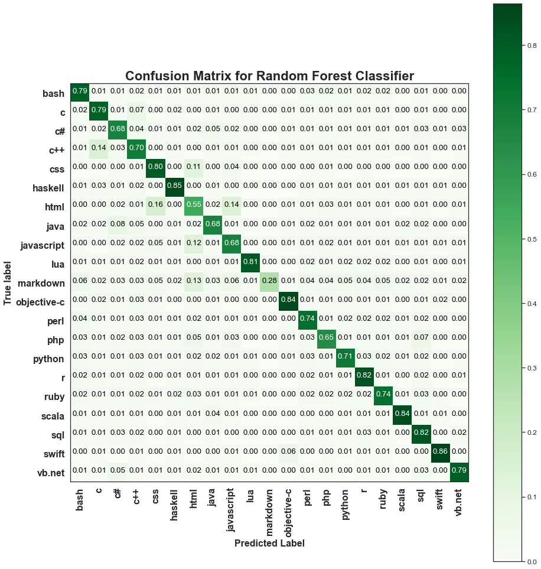
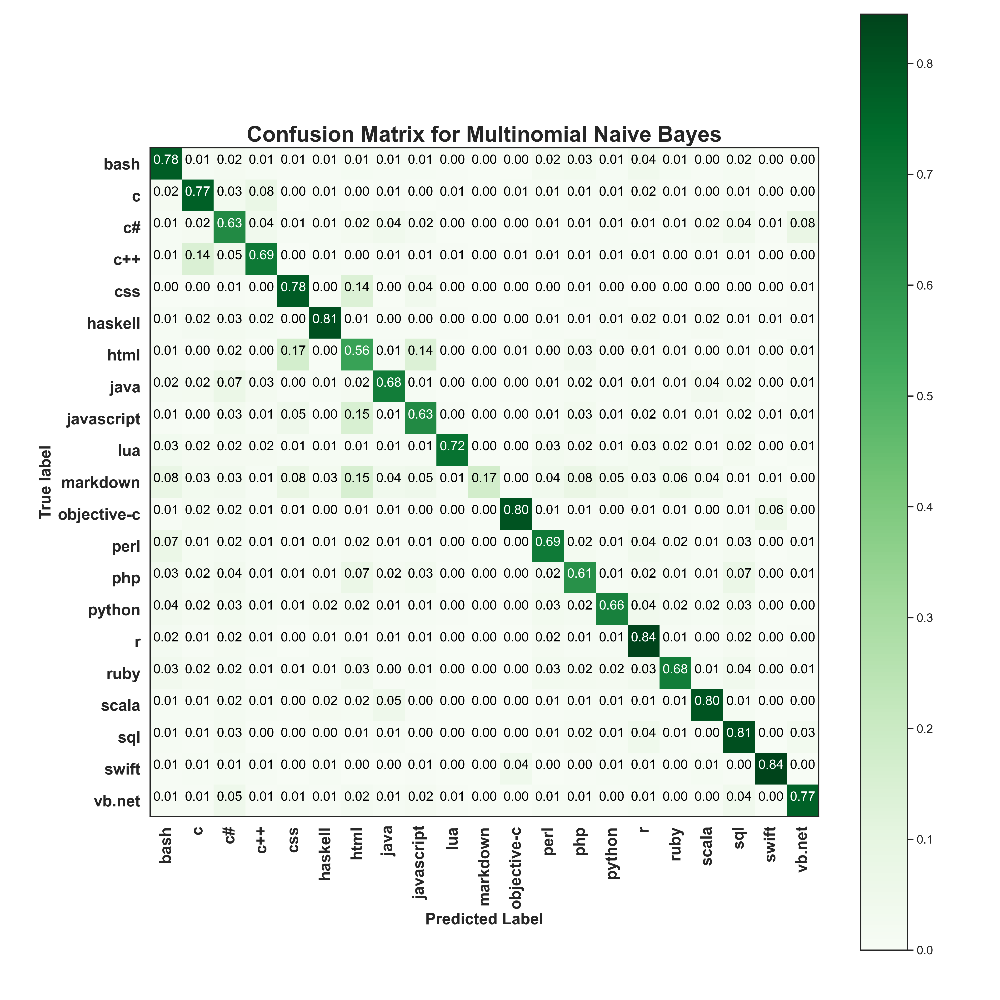
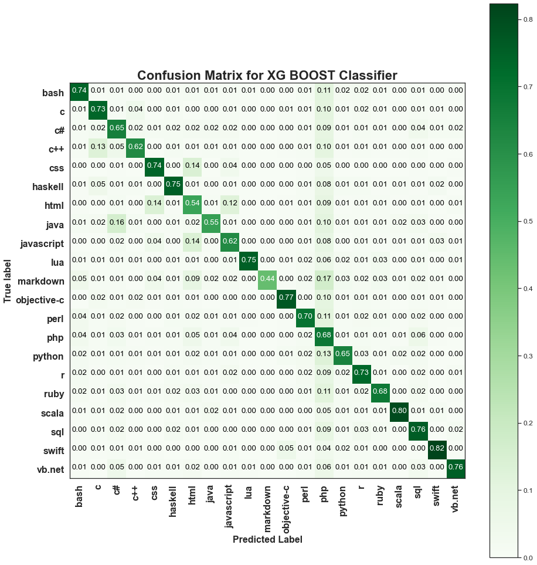

# Autonoumous Source Code Classification using Machine Learning and Natural Language Processing

## Dataset

https://drive.google.com/file/d/1DXp7omXlGkckk9PwiTAxEZIvwrfbm2WZ/view?usp=sharing

## Results

  

  

  

